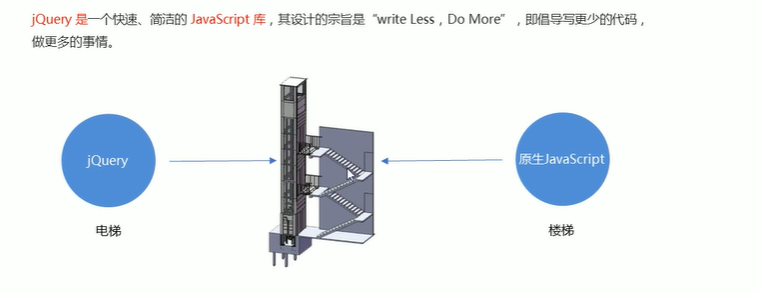
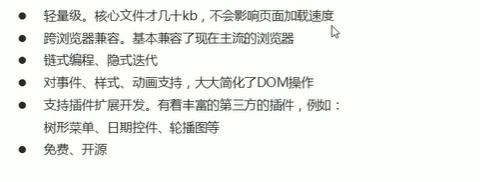
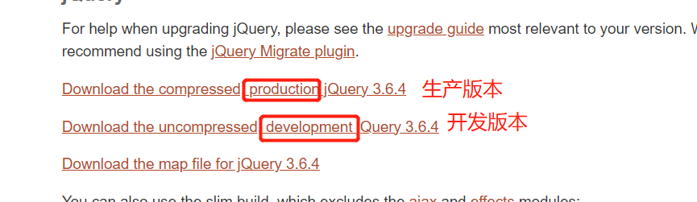

# JQuery概述

## JavaScript库

- 仓库：(现实意义)可以把很多东西放在仓库里，找东西只需要到仓库里查找就好了。

- **JavaScript库**：即library，是一个封装好的特定的集合(方法和函数)。从封装一大堆函数的角度理解库，就是在这个库中，封装了很多预先定义好的函数在里面，比如动画animate、hide、show，比如获取元素等。

- **JS库简单理解**：就是一个JS文件，里面对**原生js代码**进行了封装，存到到里面。这样我们就可以快速高效的使用封装好的功能。（之前学习的都是原生的JS）。比如JQuery，就是为了快速方便的操作DOM，里面基本都是**函数(方法)**。

- **常见的JavaScript库**

  - jQuery

  - Prototype

  - YUI

  - Dojo

  - Ext JS

  - 移动端的zepto

这些库都是对**原生的JavaScript的封装**，内部都是用JavaScript实现的，我们主要学习的是jQuery。

## jQuery的概念

- jQuery是一个快速、简洁的JavaScript库，其设计的宗旨是“write less,Do Mroe”，倡导写更少的代码、做更多的事情。

- j是JavaScript，Query查询，jQuery意思就是查询js,**把js中的dom操作做了封装**，我们可以快读的查询使用里面的功能。

- jQuery封装了JavaScript常用的功能代码，优化了DOM操作、事件处理、动画设计和Ajax交互。

- 学习jQuery的本质：学习调用这些函数(方法)

- **jQuery出现的目的是加快了前端人员的开发速度，我们可以非常方便的调用和使用它，从而提高开发效率。**

  

- **优点**

  

## JavaScript基本使用

- 下载地址

  - https://jquery.com/download/

  * 生产版本是压缩过的，打开是看不懂其中的内容的。

  - 开发版本有缩进、有换行，是可以看懂的。

- **下载方法**：进入对应版本页面，ctrl+a全选，ctrl+v复制，粘贴到vscode的新建文件中。

- **使用方法**：

https://www.bilibili.com/video/BV1a4411w7Gx/?p=4&spm_id_from=pageDriver&vd_source=dde2f4dd432156027fedf9b1734ba705

