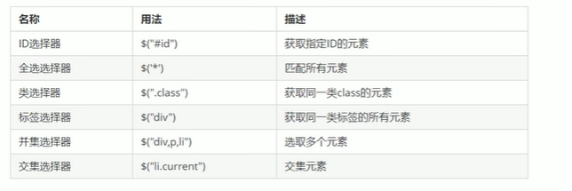
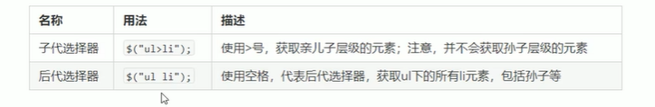
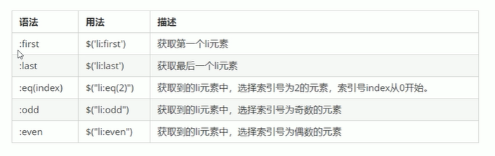
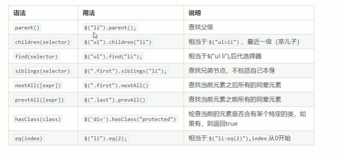
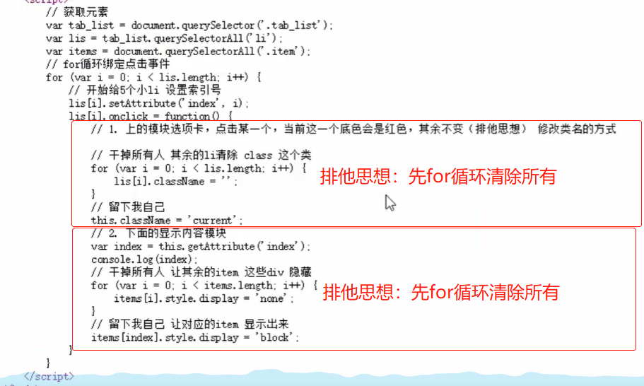
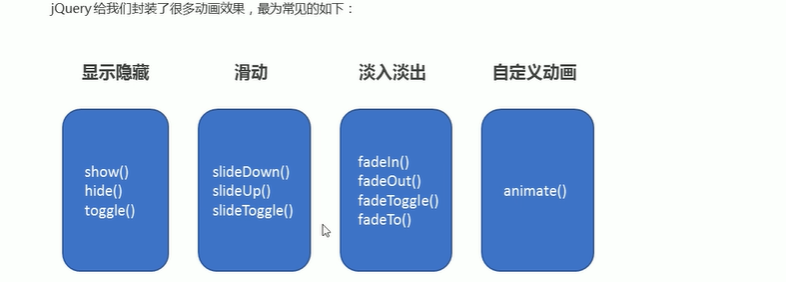
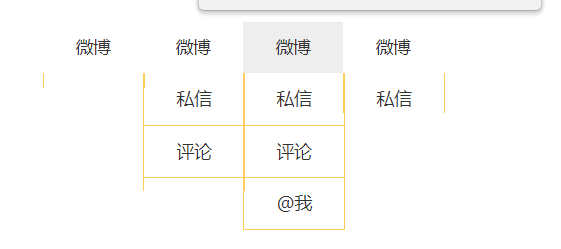
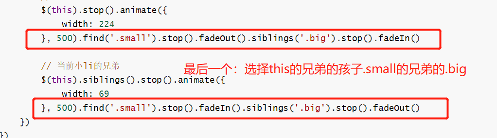

# jQuery常用API

## jQuery选择器

### jQuery基础选择器

原生JS获取元素方式很多，很杂，兼容性情况不一，因此jQuery做了封装，使获取元素有统一标准。

```javascript
$('选择器')  //选择器：直接写css选择器即可
```





### jQuery隐式迭代（重要）

+ 遍历内部DOM元素（伪数组形式存储）的过程叫做<font color=red>隐式迭代</font>。

- **简单理解**：给匹配到的所有元素进行循环遍历，执行相应的方法，而不用程序员手写循环，简化操作。

- 知识铺垫

  ```javascript
  // jQuery修改样式
  $('选择器').css('属性名','属性值')
  ```

### jquery筛选选择器

筛选需要的元素



注意:

- odd和even的索引号是从0开始

  - 选择奇数索引号，等于常见的选择偶数行

  - 选择偶数索引号，等于常见的选择奇数行

### jQuery筛选方法（重点）

注意：以下都为**方法的方式**获得指定元素，记得加小括号。使用$符号选择的指定元素是**选择器方式。**

- 筛选方法：获得了一个jQuery对象，按照方法查找与它有关系的节点
- 类似于dom中的按照节点关系查找



- `parent() `      最近一级的父级元素，只返回一个，只选择亲父亲

- `children()`  子代选择，只选择亲孩子；可能有多个孩子，括号里可以写基础选择器选择指定孩子

-  `find()   `          后代选择，返回多个，只要是后代都可以

补充：

hide()  隐藏元素

show()  显示元素

### jQuery中的排他思想

- 当前元素设置样式，其余兄弟元素清除样式。

  ```javascript
  $(function () {
  	$('button').click(function () {
  		$(this).css('background-color','pink')
  		// 其他兄弟：隐式迭代，每个兄弟都应用了这个属性；
          // 注意查找得到是伪数组，在js要单独对每个数组元素进行操作而不能对整理
  		$(this).siblings('button').css('background-color','')
     })
  })
  ```

### 链式编程

链式编程是为了节省代码量，看起来更优雅。

```javascript
// 将上一节的排他思想修改为链式编程 
$(this).css('background-color', 'pink').siblings().css('background-color', '')
```

## jQuery样式操作

### 操作css方法

- jQuery可以使用css方法来修改简单元素样式。简单样式推荐这个
- 也可以操作类，修改多个样式。复杂推荐这个

1. 参数只写了属性名，不写属性值：那么返回属性值

   ```javascript
   $(this).css('color')
   ```

2. 参数是**属性名，属性值，逗号分隔**，是设置一组样式。

   注意：属性必须添加引号；值如果是数字可以不用跟单位和引号

   ```javascript
   $(this).css('color','red')
   ```

3. 参数可以是对象形式，方便设置多组样式。

   属性名和属性值用冒号隔开，**属性名可以不用加引号**，值如果是数字可以不用跟单位和引号。

   ```javascript
   $(this).css({'color':'white','font-size':'20px'})
   ```

### 设置类操作

作用等同于以前的classList，可以操作类样式，注意操作类里面的参数不要加符号点`.`。

1. 添加类

   ```javascript
   $('div').addClass('current')
   ```

2. 移除类

   ```javascript
   $(this).removeClass('current')
   ```

3. 切换类

   ```javascript
   $(this).toggleClass('current')
   ```

   

### tab栏切换小案例 

1. 使用jQuery方法执行

   jQuery中的排他思想，**不使用**

   - 先查找含指定类的元素，移除他的这个类
   - 也不使用for循环先remove所有元素的指定类

   **使用**：

   - 链式法则：自己添加指定类，所有兄弟移除指定类

   ```javascript
   <script>
       $(function () {
           $('.tab_list li').click(function () {
               // tab栏切换模块
               // 自己显示被点击IDE效果，排他思想:自己添加,自己的所有兄弟全部清除
               $(this).addClass('current').siblings().removeClass('current')
               let index = $(this).index()
   
               // 下方模块显示
               $('.tab_con div').eq(index).show().siblings().hide()
            })
       })
   </script>
   ```

2. 使用JS方法执行

   排他思想：使用for循环在登基之前清除所有元素的指定类



### jQuery类操作细节

原生JS中的className会覆盖元素原先的类名。

jQuery里面的类操作只是针对类进行操作，不影响原来的类名。

```javascript
addClass()
removeClass()
toggleClass()
```

## jQuery效果




### 显示隐藏效果

某个元素显示或隐藏的时候可以产生的动画效果，效果是：向左上角收起，或者从左上角放出。

1. 显示show()

   ```javascript
   show([speen,[easing],[fn]])
   ```

2. 隐藏hide()

   ```javascript
   hide([speen,[easing],[fn]])
   ```

3. 切换toggle()

   切换的意思是，如果当前在显示那么切换为隐藏；如果当前为隐藏那么切换为显示

   ```javascript
   toggle([speen,[easing],[fn]])
   ```

**参数说明**

- 三个参数都可以省略，无动画直接显示；一般都不写任何参数，有动画太丑了
- seped：切换的速度，字符串：slow,normal,fats；或者是数值,单位毫秒。
- easing:用来指定切换效果，默认是swing，还可以用linear
- fn:回调函数，在动画完成时执行的操作，每个元素执行一次

### 滑动效果

某个元素在显示隐藏时的效果是：

- 下拉滑动显示，**注意不会自动回收**
- 上拉滑动隐藏

- 滑动切换：没有就下拉显示，有就上拉消失。

常见场景：下拉菜单栏、导航栏常用。

1. 下拉滑动

   ```javascript
   sildeDown([speen,[easing],[fn]])
   ```

2. 上拉滑动

   ```javascript
   sildeUp([speen,[easing],[fn]])
   ```

3. 切换滑动

   ```javascript
   sildeToggle([speen,[easing],[fn]])
   ```

   **参数说明**

   - 三个参数都可以省略。
   - seped：切换的速度，字符串：slow,normal,fats；或者是数值,单位毫秒。
   - easing:用来指定切换效果，默认是swing，还可以用linear
   - fn:回调函数，在动画完成时执行的操作，每个元素执行一次

### 事件切换

hover:鼠标经过和离开的复合写法，代码更加简洁。

- 有两个参数时

  第一个参数代表鼠标经过时的处理函数，第二个参数代表鼠标离开时的处理函数

  ```javascript
  hover(functon(){},functon(){})
  ```

- 有一个参数时

  代表鼠标经过和离开时都是这个处理函数

  ```javascript
  hover(functon(){})
  ```

案例：鼠标经过和离开时导航栏的变化。使用这个函数十分简单，代码很优雅。

```javascript
<script>
    $(function () {
        // 写法1
        // 鼠标经过时下拉显示
        $('.nav li').mouseenter(function () {
            $(this).children('ul').slideDown(500)
        })
        // 鼠标离开时上拉隐藏
        $('.nav li').mouseleave(function () {
            $(this).children('ul').slideUp(500)
        })


        //写法2, 使用事件切换简写
        $('.nav li').hover(function () { $(this).children('ul').slideDown(500) },
            function () { $(this).children('ul').slideUp(500) }
        )

        // 写法3,事件切换一个参数形式
        $('.nav li').hover(function () { $(this).children('ul').slideToggle(500) })
    })
</script>
```

### 动画队列

1. 动画或效果队列

   动画或效果一旦触发就会执行，如果多次触发，就会造成多个动画或者效果排队依次执行。

   例如，在上一节的导航栏案例，连续多次快速滑动，多个下拉全部显示。

   

   **现在想要修复的问题：多次快速滑动的时候停止显示**

2. **停止排队**

   ```javascript
   stop()
   ```

   - stop方法用于停止动画或效果
   - 注意：stop（）写到动画或者效果的<font color=red>前面，相当于停止结束上一次的动画。（短时间内频繁触发，结束之前的动画，执行本次的动画）</font>

   ```javascript
    <script>
   	$(function () {
   	    $('.nav li').hover(function () { $(this).children('ul').stop().slideToggle(500) })
   	})
   </script>
   ```

### 淡入淡出效果

某个元素在显示隐藏时的效果是：

- 淡入效果：整个慢慢显示
- 淡出效果：整个慢慢消失

- 淡入淡出切换：有则慢慢消失，没有则慢慢消失
- 透明度：修改某个元素的透明度；淡入效果也会收到影响。

常用场景：多个图片，鼠标滑动某个则该元素高亮显示，其他暗色显示。

1. 淡入效果

   ```javascript
   fadeIn([speen,[easing],[fn]])
   ```

2. 淡出效果

   ```javascript
   fadeOut([speen,[easing],[fn]])
   ```

3. 淡入淡出切换

   ```javascript
   fadeToggle([speen,[easing],[fn]])
   ```

   **参数说明**

   - 三个参数都可以省略。
   - seped：切换的速度，字符串：slow,normal,fats；或者是数值,单位毫秒。
   - easing:用来指定切换效果，默认是swing，还可以用linear
   - fn:回调函数，在动画完成时执行的操作，每个元素执行一次

4. 修改透明度

   渐进方式调整到指定的不透明度，可直接修改某个元素的透明度显示情况。

   ```javascript
   fadeTo(speed,opacity,[easing],[fn])
   ```

   **参数要求**

   - <font color=red>opacity透明度必须写，取值0~1之间</font>

   - <font color=red>speed：</font>三种预定速度之一的字符串或数字，<font color=red>必须写</font>

     使用fadeTo后，fadeIn效果也会带透明度

### 自定义动画animate（常用）

#### 基础知识

**语法**

```java
animate(params,[speed],[easing],[fn])
```

**参数**

- <font color=red>params:想要更改的样式属性，以对象的形式传递，必须写。</font>属性名可以不用带引号，如果是**复合属性**(在css中用连字符相连的)则需要采取驼峰命名法。

  以下三个属性可以省略

- seped：切换的速度，字符串：slow,normal,fats；或者是数值,单位毫秒。

- easing:用来指定切换效果，默认是swing，还可以用linear

- **fn:回调函数，在动画完成时执行的操作，每个元素执行一次**

#### 王者荣耀案例

手风琴效果或者折叠卡片：点击谁谁放大，其他的要缩小。


```javascript
<script>
    $(function () {
        $('.king li').mouseenter(function () {
            /* 修改类的方法 */
            // $(this).addClass('current').siblings().removeClass('current')

            /*jQuery方法*/
            // 修改当前小li
            $(this).stop().animate({
                width: 224
            }, 500).find('.small').stop().fadeOut().siblings('.big').stop().fadeIn()

            // 当前小li的兄弟
            $(this).siblings().stop().animate({
                width: 69
            }, 500).find('.small').stop().fadeIn().siblings('.big').stop().fadeOut()
        })
    })
</script>
```

**注意**

链式法则：



到后面的辈分关系，**是以自己前面紧跟的那个为参考查找的**。

```html
<li>
    
    
</li>
<!-- 链式法则通过li找samll找big的方法：big是small的兄弟 -->
$('li').find('.small').silibings('.big') 
```


