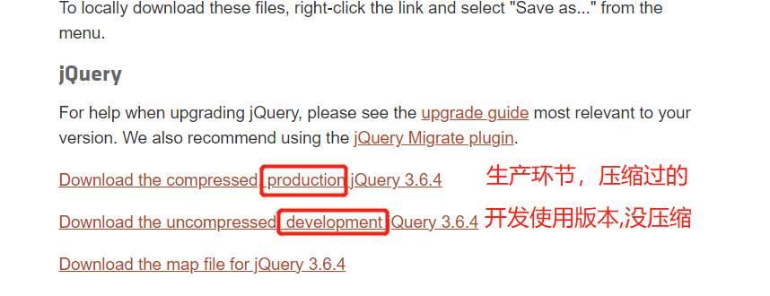
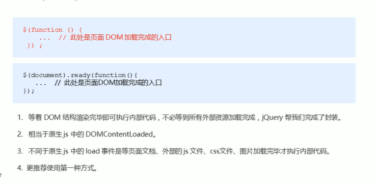

## Jquery概述

### JavaScript库

仓库：可以把很多东西放到仓库里面，找东西只需要到仓库里面查找就可以了。

**JavaScript库**：

- 即library，是一个<font color=red>封装好的特定的集合（方法和函数）</font>。

- 从封装一大堆函数的角度理解库，就是在这个库中，封装了很多预先定义好的函数在里面，比如动画animate、hide、show，比如获取元素等。

- **简单理解**：就是一个JS文件，里面对**原生JS代码进行封装**，存放到了里面。这样就可以快速高效的使用这些封装好的功能。

**常见的JavaScript库**

- jQuery
- Prototype
- YUI
- Dojo
- Ext JS
- 移动端的zepto

这些库都是对原生JavaScript的封装，<font color=red>内部都是用原生JavaScript实现的</font>，我们主要学习的是<font color=red>Jquery</font>。

### jQuery概念

- <font color=red>Jquery是一个快速、简介的JavaScript库</font>，宗旨是wrire less,do more，倡导写更少的代码，实现更多的功能。

  J就是JavaScript；Query是查询；意思是查询js，把js中的DOM操作做了封装，可以快速查询里面的功能。

- <font color=red>jQuery封装了JavaScript常用的功能代码</font>，优化了DOM操作、事件处理、动画设计和Ajax交互。

  学习JQuery的本质：就是学习调用这些函数（方法）。

- jQuery的出现加快了前端人员的开发进度，把走楼梯改成了坐电梯。

## jQuery基本使用

### 下载方法

1. 下载网址https://jquery.com/download/ 
2. 点击进入需要使用的版本的页面



3. ctrl+a 全部复制粘贴，保存到自己工作目录中

### jQuery的入口函数




```javascript
// 需求2:把jQuery写在dom元素上面,想要隐藏div
// 原生JS先有dom元素才能操作，等待页面加载完了才能执行js代码；这里也一样，
// 原生解决方法：load、domContentLoaded这两个事件

// 1.等待页面DOM加载完毕再去执行JS代码
$(document).ready(function(){
    $('div').hide()
})
// 2.等待页面DOM执行完毕再去执行JS代码
$(function () {
    $('div').hide()
})
```

### jQuery的顶级对象$

1. \$是jQuery的别称，在代码中二者可以相互替换，但一般为了方便，通常直接使用\$

2. $是jQuery的顶级对象，相当于原生JavaScript中的window（不是真的相等，只是地位类似）。

   通过$符号把元素包装成jQuery对象，就可以调用jQuery方法。

### jQuery对象和DOM对象

1. 用原生JS获取来的对象就是DOM对象

2. 用jQuery方法获取来的对象就是jQuery对象

   jQuery对象的本质是：利用$对DOM对象包装后产生的对象（伪数组形式存储）

3. **二者的方法和属性不能混用**

   - jQuery对象只能使用jQuery方法

   - DOM对象则使用原生的JavaScript属性和方法

   ```javascript
   <script>
       // 1.DOM对象:用原生JS获取得到的对象
       const div = document.querySelector('div')
       console.dir(div)
       // 2.jQuery对象:用jQuery方法获得的对象
       $('div')
       console.dir($('div'))
       // jQuery对象只能使用jQuery方法,DOM对象则使用原生的JavaScript属性和方法
   </script>
   ```

#### DOM对象和jQuery对象转换

​	在特殊情况下需要这两个之间相互转换,比如有些DOM对象可以使用的方法但是JQuery对象不能使用，这时就需要转换。

1. DOM对象转jQuery对象

   ```javascript
   // 语法
   $(已经获取的dom对象)  //不需要添加''
   
   // 示例
   const vi = document.querySelector('video')
   $(vi)  // 注意这里面不用写‘’,因为已经是变量了
   ```

2. jQuery对象DOM对象

   ```javascript
   // 语法
   $('')[index]
   $('').get(index)
   
   // JQuery对象没有这个方法，不能直接使用，要先转换
   $('div')[0].play()   // 里面的div是标签
   $(vi)[0].play()      // 里面vi是dom对象,已经是一个变量了
   $(vi).get(0).play()
   ```

   


