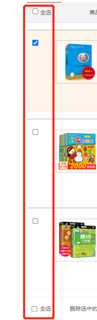
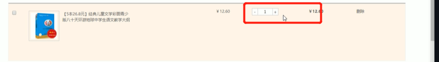
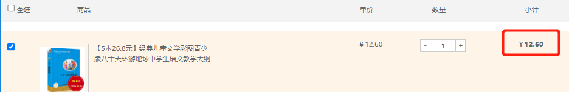
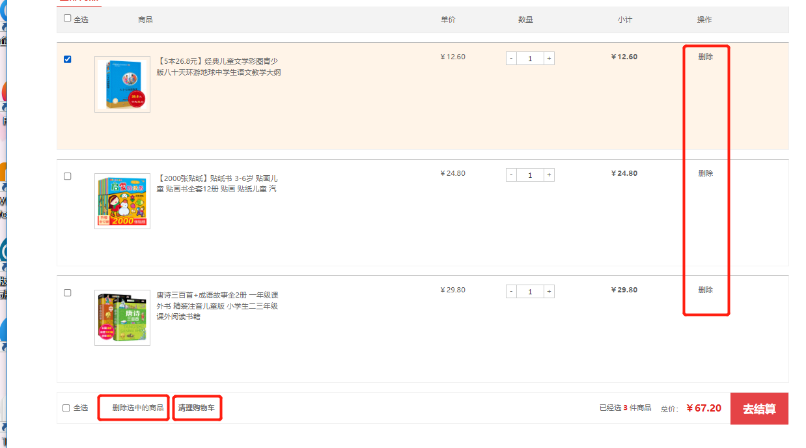

# jQuery常用API

## 元素属性操作

### 元素常用属性prop()

1. 获取元素常用属性

   href、title、src、type、checked

   ```javascript
   $('选择器').prop('属性名')
   ```

2. 设置元素常用属性的值

   ```javascript
   $('选择器').prop('属性名','属性值')
   ```

### 元素自定义属性值attr()

1. 获取元素自定义属性

   ```javascript
   $('选择器').attr('自定义属性名')
   ```

2. 设置元素自定义属性

   ```javascript
   $('选择器').attr('自定义属性名','属性值')
   ```

3. h5新增自定义属性

   也可以使用attr获得，中间的连字符`-`直接写即可。

### 数据缓存data()

- 可以在指定元素上存取数据，并不会修改DOM元素结构。一旦页面刷新，之前存放的数据都将被移除。

- 简单理解：把元素当做变量，把数组存在这个元素上；在dom页面上看不到数据值。

1. 设置元素值

   ```javascript
   $('选择器').data('属性名','属性值')
   ```

2. 获取元素值

   ```javascript
   $('选择器').data('属性名')
   ```

3. data()还可以获得h5自定义属性

   注意：这里的属性名不用写data-，直接写后面的；而且返回数字类型

   ```javascript
   $('选择器').data('属性名') // 这里的属性名不用写data-，直接写后面的；而且返回数字类型
   ```

## jQuery内容文本值

1. 获取元素内容（相当于原生的innerHTML）

   返回标签里面的：文本内容+子标签

   ```javascript
   $('选择器').html()
   ```

2. 修改元素内容

   如果方法括号为空就是获取，括号里面有内容就是赋值。

   ```javascript
   $('选择器').html('修改内容')
   ```

3. 获得文本内容（相当于原生的innerText）

   只返回文本内容，忽略标签

   ```javascript
   $('选择器').text()
   ```

4. 获取表单的值（相当于原生的value）

   ```javascript
   $('input').val()             // 获取
   $('input').val('pink')       // 设置
   ```

## 补充：返回指定祖先元素parents

```javascript
parents()         // 返回全部祖先元素
parents('选择器')  // 返回指定祖先元素
```

而不需要使用parent()一直向上一层一层的找，更加方便简单。

## jQuery元素操作

这一章节介绍一下四个元素操作

- 遍历
- 创建
- 添加
- 删除

### 遍历元素

jQuery隐式迭代对有所元素做了**相同的操作**。如果想要给同一类元素做不同的操作，那么就需要遍历。

**方法1**

```javascript
$('div').each(function(index,domEle){xxx;})
```

**说明**

- each()方法遍历匹配的每一个元素。**主要用DOM处理，each是每一个的意思。**
- 里面的回调函数有2个参数：
  - index是每个元素的索引号；
  - domEle是每个<font color=red>每个DOM元素对象，不是jQuery对象</font>
- <font color=red>如果想使用jQuery方法，还需要把domEle元素转换为jQuery对象$(domEle)</font>

**适用场景**：遍历获取得到的dom对象


**方法2**

```javascript
$.each(object,function(index,ele){xxx;})
```

**说明**

- $.each()方法可用于遍历任何对象。主要用于数据处理，比如数组，对象
- 里面的函数有2个参数：
  - index是每个元素的索引号；如果是对象则是属性名
  - element遍历内容；如果是对象则是属性值
- **适用场景**：遍历数组、对象等

### 创建元素

```javascript
$("html元素和内容") 
```

创建后在页面不显示，还需要将创建的标签添加的页面中。

### 添加元素

1. 内部添加：父子关系

   ```javascript
   $('选择器').append(创建的节点)  // 选中的元素内部添加，放到最后面
   $('选择器').prepend(创建的节点) // 选中的元素内部添加，放到最前面
   ```

2. 外部添加：兄弟关系

   ```javascript
   $('选择器').after(创建的节点)  // 选中的元素外部添加，放后面
   $('选择器').before(创建的节点) // 选中的元素外部添加，放前面
   ```

### 删除元素

1. 删除匹配的元素 自杀

   ```javascript
   $('选择器').remove()
   ```

2. 删除匹配元素里面的子节点 孩子

   ```javascript
   $('选择器').empty()
   ```

3. 删除匹配元素里面的子节点 孩子

   ```javascript
   $('选择器').html("")
   ```


## jQuery尺寸、位置操作

### jQuery获得元素尺寸

| 语法                               | 用法                                                         |
| ---------------------------------- | ------------------------------------------------------------ |
| width()/height()                   | 获得匹配元素的宽度和高度值 只算width/height                  |
| innerWidth()/innerHeight()         | 获得匹配元素的宽度和高度值 包括width/height+padding          |
| outerWidth()/outerHeight()         | 获得匹配元素的宽度和高度值 包括width/height+padding+border   |
| outerWidth(true)/outerHeight(true) | 获得匹配元素的宽度和高度值 包括width/height+padding+border+margin |

width()/height()括号里添加值就是赋值操作

 ### jQuery位置操作

元素的位置主要有三个：offset()、position()、scrollTop()/scrollLeft()

1. offset() 	**获得或设置元素偏移**

   - 该偏移是**距离整个文档的位置**，相对于文档的顶部、左侧的距离。

     <font color=red>与父级没关系，就算父盒子和自己有定位，也不受影响。</font>

   - 可读写的，小括号内写值即为赋值操作。

     赋值不影响父盒子的位置，只改变自己的位置。

   - 该方法有两个属性left、top

     - offset().top  获取距离文档顶部的偏移
     - offset().left  获取距离文档左侧的偏移

   - 可以设置元素的偏移

     offset({top:10,left:20})

2. position()     **获得元素偏移**

   - 获得<font color=red>带有定位的父元素的偏移</font>。如果没有定位，则以文档为参照。
   - 这个方法只能获取，不能设置。

3. scrollTop()/scrollLeft()     **获取或设置元素被卷去的头部/左侧距离**

   ```javascript
   // 需求：当划到div盒子的上沿时，显示返回顶部
   $(function () {
       $(window).scroll(
           function () {
               if ($(document).scrollTop() >= $('.container').offset().top) {
                   $('.back').fadeIn()
               } else {
                   $('.back').fadeOut()
               }
           }
       )
   
       // 返回顶部
       $(".back").click(function() {
           // $(document).scrollTop(0);  // 没有动画：直接滑动上去效果不好
           $("body, html").stop().animate({ 
               scrollTop: 0
           });
           // $(document).stop().animate({
           //     scrollTop: 0
           // }); 不能是文档而是 html和body元素做动画
       })
   
   })
   
   ```

- $('html,body') 为什么要写2个?

   为了兼容性，firefox ie 不支持 body, chrome 支持的是body。

## 购物车案例

### 模块1:全选复选



需求：大控制小、小控制大

- 大控制小：全选按钮被选中，则下面的复选框全部选中；注意点：选中一个全选框，另外一个也要选中

  注意点：`$('选择器1,选择器2')`并集选择器实现两个

- 小控制大：所有的复选框都勾选上，则全选框也被选中；所有复选框取消勾选，那么全选框也取消勾选。

  注意点：`$('选择器:checked')`选择被勾选的框

### 模块2：增减商品数量

需求：点击加号或减号修改商品数量



注意：

- 只能增加本商品的数量，不能增加别的。

  实现：+号或者-号兄弟的文本框。

  因为各个商品之间在不同盒子里，每个商品的小盒子包含了这些加号框、减号框、数量表单

- 当文本框的数量为1的时候，不能再减少了。

  实现：if(数量===1) return false，后面的代码不会再执行。

  

### 模块2新增功能：修改商品小计

需求：点击加号或减号修改商品数量时，同时修改小计



注意：

- 只能修改本商品的小计

- 单价里面有￥符号，需要把人民币￥符号去掉再相乘，截取字符串substr(1)

  ```javascript
  substr(1) // 从第一个开始取到最后；注意得到字符串类型，隐式转换为数字型
  ```

- 小计输出的时候要添加￥

  ```javascript
  html('￥'+ n*p ) 
  ```

- <font color=red>上述方法输出小计的时候，小数点变成了一位</font>

  现在要保留两位小数

  ```javascript
  toFixed(n)   // 保留n位小数
  ```

  ```javascript
  html('￥'+ (n*p).toFixed(2) ) // 保留两位小数
  ```

### 模块2优化：商品数量模块用户收手动输入

需求：当用户不点击加减符号，而是直接输入商品数量，这时商品小计不会发生变化。正确的需求：商品小计跟随用户的输入发生变化。

实现：表单change事件

```javascript
 // 模块2优化：用户手输文本框商品数量
$('.itxt').change(function(){
    let n = $(this).val() // 获得输入的值
    let p = $(this).parents('.p-num').siblings('.p-price').text().substr(1)// 获得单价
    $(this).parents('.p-num').siblings('.p-sum').html('￥'+ (n*p).toFixed(2))// 输出小计
})
```

注意：要写符号点.

### 模块3：购物车汇总，已选择商品总数量，总价


注意点

- 总数量是文本框内的值，取过来的值也是字符型，要转换成数字类型

- 总计价格是盒子里的文本值，且有人民币符号，

  需要去人民币符号，然后转换成数字类型

- 需要计算总价的时间

  - 刚开始打开页面
  - 用户点击加减号后
  - 用户手输数量后

  **解决方法：因此定义一个函数，在上述各个场景分别调用**

  

### 模块4：删除模块

需求，有三个地方需要删除：

​	1.商品删除按钮

2. 点击删除选中的商品
3. 清空购物车




注意点：

- 删除了之后还需要重新调用getSum()函数计算总额

### 模块5：选中商品添加背景

需求：

- 全选框：勾选全部商品添加背景，取消勾选全部商品取消背景；

  实现：选择商品大盒子的类，隐式迭代实现

- 小的复选框：

  注意：只有自己的盒子显示或隐藏背景，不可使用隐式迭代

  实现：使用`$(this).parnets('大盒子')`给自己的商品盒子添加或隐藏背景


## 电梯导航案例

细节

- 大控制小，版心内容控制左侧电梯导航

  为了更好的用户体验，可以在版心距离浏览器顶部还有一点距离时，左侧的电梯导航栏目就现实为该盒子。

  而不需要等到该版心的内容的标题完全与浏览器顶部重合时

- 小控制大，点击时使用互斥锁禁用大控制小滑动效果

  保证电子导航栏目的地与终点之间的栏目不会一次闪烁被选中的效果

  


