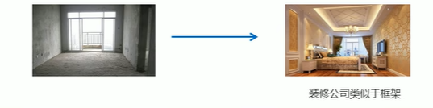

## Bootstrap前端开发框架

毛坯房自己装修比较慢，而且不专业；如果找装修公司里面有很多模板，快速且专业。

Bootstrap就类似于装修公司。

### Bootstrap简介

#### 基础知识

Bootstrap来自推特，是目前最受欢迎的前端框架。Bootstrap基于HTML、CSS和JavaScript，简单灵活，<font color=red>使得Web开发更加快捷。</font>

- 中文官网：https://www.bootcss.com/ 使用这个即可
- 官网：https://getbootstrap.com/

**框架**：顾名思义就是一套架构，是一套比较完整的网页功能解决方案，而且控制权在框架本身，有预制样式库、组件和插件。使用者按照框架规定的某种规范开发。



#### 优点：

- 标准化的html+css编码规范
- 一共了一套简洁、直观、强悍的组件
- 有自己的生态圈，不断迭代更新
- 让开发更简单，提高了开发的效率

#### 版本


### Bootstrap使用

这里只介绍Bootstrap样式库，JS库后面讲。

Bootstrap使用四部曲：1.创建文件夹结构、2.创建html骨架结构、3.引入相关样式文件、4.书写内容。

**1.创建文件夹结构**

创建最外层的各种文件夹：images css bootstrap ,进入bootstrap解压在bootstrap网站下载的压缩包为第二章图片的形式。


**2.创建html骨架结构**

点击入门→下滑，查找基本模板，在里面找到下面的代码复制粘贴到vscode文件中（前两行vscode框架自动生成，后两行去bootstrap复制粘贴）


 

**3.引入相关样式文件**

head标签中引入bootstrap文件夹下的css文件,min版本。

```javascript
<link rel="stylesheet" href="bootstrap/css/bootstrap.min.css">
```

判断正确引入的方法：写一个有内容的div标签，如果该div标签去除了浏览器默认边距紧贴浏览器，说明引入成功。

**4.书写内容**

- 直接把bootstrap预先定义好的样式来使用
- 修改bootstrap原来的样式，注意权重问题
- 学好bootstrap的关键在于知道<font color=red>它定义了哪些样式，以及这些样式能实现什么效果</font>

### 布局容器

bootstrap需要为页面内容和栅格系统包裹了一个.container容器，bootstarp<font color=red>预先定义好了这个类</font>，叫`.container`。它提供了两个做该用处的类。

**1.container类**

- 响应式布局的容器       固定宽度（内容宽度）
- 大屏（>=1200px）     宽度定为 1170px
- 中屏（>=992px）       宽度定为 970px
- 小屏（>=768px）       宽度定为 750px
- 超小屏（100%）  

用来做响应式开发

**2.container-fluid类**

- **流式布局百分比宽度**，永远和屏幕一样宽
- 占据全部视口（viewport）的容器
- **适合于单独做移动端开发**

## bootstrap栅格系统

### 栅格系统简写

简单理解：页面内容划分为**12等分**，屏幕宽度变化，12等分的各个宽度也会发生变化。

bootstrap提供了响应式、移动设备优先的流式栅格系统。


---

响应式的效果：下面的四个栏目，当页面逐渐缩小时，显示的内容逐渐变成3个、2个、1个。

使用百分比制作，或者flex布局实现不了上面的响应式效果。


注意：**不是所有的盒子都需要使用栅格系统，需要分多个列的各个盒子才需要用栅格系统。**

### 栅格选项参数

栅格系统由行，列组成，html页面设置也是先行后列。


- 示例

  大屏幕每个盒子占3份    一行显示4个 
  中屏幕每个盒子占4份    一行显示3个
  小屏幕每个盒子占6份    一行显示2个 
  超小屏幕每个盒子占12份 一行显示1个 

```javascript
<div class="container">
    <!-- 必须首先写行，将栅格系统包在行里面 -->
    <div class="row">
        <div class="col-lg-3 col-md-4 col-sm-6 col-xs-12">1</div>
        <div class="col-lg-3 col-md-4 col-sm-6 col-xs-12">2</div>
        <div class="col-lg-3 col-md-4 col-sm-6 col-xs-12">3</div>
        <div class="col-lg-3 col-md-4 col-sm-6 col-xs-12">4</div>
    </div>
</div>
```

注意：

- 如果孩子的份数相加等于12，那么占满整个.container
- 如果孩子的分数相加小于12，那么后面为空
- 如果孩子的分数相加大于12，那么后面的格子自动换行

### 列嵌套


**使用场景：**

1. **给盒子设置类似padding的效果**。(栅格系统没办法设置padding)
2. 盒子里面需要再嵌套盒子

**注意**：

- **生成的盒子里面会默认有15px的padding**，因此在使用嵌套盒子时：

- 需要添加一个.row的类，这样可以取消父元素的padding（子元素贴着父元素的边），同时让子元素的高度和父亲相同。

### 列偏移


响应式：宽度都是自适应的，给的都不是固定的值。**所以不能写固定的margin**

示例：


```javascript
<div class="container">
    <div class="row">
        <div class="col-md-4">左侧</div>
		<!-- 向右边偏移了4个列的距离 -->
		<!-- 偏移距离=12-两个盒子的分数 -->
        <div class="col-md-4 col-md-offset-4">右侧</div> 
    </div>
</div>
```

上面偏移的实现方法也是添加了margin值，这个margin值有浏览器计算，会变化。

### 列排序


把上面的左侧盒子和右侧盒子交换顺序。

方法：

- 左边盒子去右边：push
- 右边盒子去左边：pull

### 响应式工具


- 上面的类名只有在指定的屏幕下才会隐藏，因此如果想多个屏幕时隐藏需要写多个类名。

- visible会显示：**是只有在指定的屏幕下才会显示**


