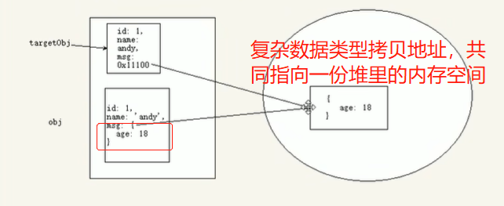
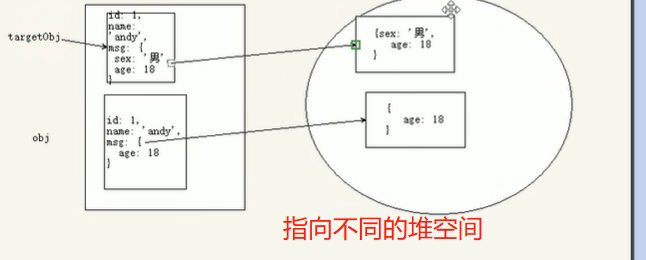

# jQuery事件

## jQuery事件注册

### 单个事件注册

**语法**

```javascript
element.事件(function(){})
// 举例
$('div').click(function(){ 代码块; })
```

- 事件类型基本和原生一致： 

  - 鼠标事件：click，mouseenter，mouseenter

  - 焦点事件：focus，blur

  - 键盘事件：keydown,keyup
  - 表单事件：input表单内容发生连续变化，change表单内容在失去焦点时发生变化
  - 其他事件：scroll

### 多个事件注册on

on的优势1：可以绑定多个事件，多个处理时间处理程序

on的优势2：可以实现事件委托

on的优势3：可以给**未来动态创建的元素绑定事件，**在on事件绑定后使用jQuery创建的新的节点也会绑定该事件。

**1.多个事件处理函数相同**

**语法**

```javascript
element.on('事件1 事件2 ... 事件n',[selector],fn)
```

- 第一个参数：用空格分隔多个事件类型
- selector ：元素的子选择器
- fn：处理函数，回调函数形式

**2.多个事件处理函数不同**

**语法**

```javascript
element.on({
    事件1:function(){},
    事件2:function(){},
    ...
    事件n:function(){}
})
```

- 注意点：记得事件后面紧跟的是函数，要记得写函数

**3.on实现事件委托**

事件委托：把加在子元素身上的事件绑定到父元素身上，就是把事件委派给父元素。

```javascript
element.on('事件1 事件2 ... 事件n',selector,fn) // 子选择器需要写，事件原来要绑定的孩子
```

```java
<ul>
        <li>我们都是好孩子</li>
        <li>我们都是好孩子</li>
        <li>我们都是好孩子</li>
        <li>我们都是好孩子</li>
        <li>我们都是好孩子</li>
</ul> 
<script>
$('ul').on('click','li',function () {
             alert(11)  })
</script>
```

**4.on实现动态绑定**

- 可以给**未来动态创建的元素绑定事件**

  在on事件绑定后使用jQuery创建的新的节点也会绑定该事件。

- 普通的`事件源.事件（处理函数）`不能实现。

```javascript
// (3)on实现事件委托，把li的事件绑定在父亲身上
$('ul').on('click','li',function ( ){     ///??父元素好像不能是新创建的
    alert(11)
})

// (4)on实现动态绑定，在他后面创建的元素也会被绑定
const li = $('<li>我是新创建的li</li>')   // 创建
$('ul').append(li) // 添加到元素中，点击新添加的li依然有弹窗
```

- 应用场景：

  微博发布评论案例，

  - 功能1：发布评论

    - 需求：在文本框输入内容后，点击发布创建新的li显示填写的内容；

      li有两个内容，文本+删除按钮。

  - **功能2：删除评论**

    - 需求：每条评论可删除，后面新增加的评论也需要绑定点击删除按钮的事件。

    - 解决方法：**使用on处理时间就可以绑定后面创建的评论栏li框的点击删除时间。**

  - 优化细节

    - 发布评论后，清除输入文本框
    - jQuery创建li后，复杂文本内容使用html()的方式添加

    - 发布评论和删除评论时，li显示效果：可以使用slidedown和slideup视觉效果更好

      第一步，先在css设置li的样式display:none；第二部，在jQuery设置li的动画效果。

## jQuery事件处理

### 事件解绑 off（）

off()方法可以移除通过on()方法添加的事件处理程序。

```javascript
$('选择器').off()          // 解绑所有事件
$('选择器').off('事件名称') // 解绑指定事件

// 解绑事件委托
$('选择器').off('事件名称','子选择器')
```

```javascript
// 特殊情况:有的事件只触发一次;触发一次后不再触发，不需要使用off解绑
$('选择器').one('事件名称',function(){})
```

### 自动触发事件

有些事件希望自动触发，比如轮播图自动播放功。自动触发而不需要鼠标或键盘等操作。

自动触发使用：使用jQuery代码模拟了用户的行为。

1. 元素.事件()，会触发默认元素的默认行为
2. 元素.trigger(‘事件’)，会触发元素的默认行为
3. 元素.triggerHandler(‘事件’)，不会触发元素的默认行为

如focus事件，默认行为：表单触发该事件后会获得光标。

其他事件的默认行为还需要遇到再补充学习。

```javascript
$(function() {
    $("div").on("click", function() {
        alert(11);
    });

    // 1.鼠标点击自动触发
    // (1)方法1
    $('div').click()
    // (2)方法2
    $('div').trigger('click')
    // (3)方法3
    $('div').triggerHandler('click')

    // 方法2和方法3的区别:方法3不会触发元素的默认行为
    $('input').on('focus',function (){
        $(this).val('你好吗')
    })
    $('input').trigger('focus') // 会获得焦点
    $('input').triggerHandler('focus') // 不会获得焦点

});

```

## jQuery事件对象

只要有事件的触发，就会有事件对象的产生。

```javascript
事件源.on('事件类型',[slector] , function(e) {} ) //参数e就是事件对象
```

```javascript
// 事件对象常用方法
e.stopPropagation()  // 阻止冒泡
e.preventDefault()  //阻止默认行为
```


## jQuery其他方法

### jQuery拷贝对象

拷贝分为浅拷贝和深拷贝，二者的区别：

- 浅拷贝直接拷贝复杂数据类型地址，原对象和拷贝对象复杂数据类型的值会相互影响

- 深拷贝在堆里重新开辟一份空间，保存复杂数据类型，栈里的属性存储该地址；原对象和拷贝对象的各个值不互相影响。

**语法**

```javascript
$.extend([deep:true/false],target,object1,[objectN]) // 把object1拷贝给target
```

1. deep：如果设置为true为深拷贝，默认false是浅拷贝

2. target、object1：target = object1

3. objectN：待拷贝的第N个对象

4. 浅拷贝是把被拷贝对象<font color=red>复杂数据类型中的地址</font>拷贝给目标对象，修改目标对象会<font color=red>影响</font>被拷贝对象。

5. 深拷贝

   目标对象和被拷贝对象的值不受影响

   

### jQuery多库共存

- **问题概述**

  jQuery使用\$作为标识符，随着jQuery和流行，其他的js库也会用这种\$符号作为标识符，这样会引起使用冲突。

- **客观需求**

  需要一个解决方法，让jQury库和其他js库不冲突，可以同时存在，这就叫多库共存。

- **jQuery解决方案**

  - <font color=red>不使用$，统一使用jQuery。比如jQuery(‘div’)</font>

  - <font color=red>jQuery变量规定新的名称,新的名称等价于旧的的名称</font>

    ```javascript
    const xx = $.noConflict() // xx = $,以后需要写$的地方用xx代替
    const xx = jQuery.noConflict() // xx = $,以后需要写$的地方用xx代替
    ```

### jQuery插件

jQuery功能比较有限，主要是一些dom操作；想要实现复杂特效效果，可以借助于jQuery插件完成。

注意：这些插件也是依赖jQuery完成的，所以使用这些插件必须先引入jQuery文件。

**插件网站推荐**

1. jQuery插件库 https://www.jq22.com/ 
2. jQuery之家     http://www.htmleaf.com/  推荐

#### jQuery之家使用教程

1. 查看需要使用的插件，下载插件解压
2. 查看jQuery下载插件的使用说明和解压后的index
3. 复制相关html/csss/js代码
4. 根据需要，修改配置参数，修改为自己需要的样式

#### 图片懒加载技术（提高页面效率）

只加载用户当前看到的页面，当用户滑动页面到可视区域，再显示图片。

jQuery插件库：比较出名的easyLazyLoad.js

注意事项：

- js引入文件和js调用必须写在DOM元素(图片)**最后面**

- script标签中

  - coverColor:不需要直接删除

  - coverDiv:不需要直接删除

#### 全屏滚动插件(fullpage.js)

没有滚动条，使用滚轮或点击页面下方，整屏滚动。

github: https://qithub.com/alvarotrigo/fullPage.js

中文翻译网站：https://www.dowebok.com/demo/2014/77/

使用步骤：

- 进入中文翻译网站，下载插件

- 查看页面的使用说明

- 引入相关文件js/css/html

- 可根据配置参数在script中设置自己需要的效果，**写成对象的形式**，例如

  ```javascript
  <script>
      $(function () {
          $('#dowebok').fullpage({
              verticalCentered: true,
              navigation: true
          });
      });
  </script>
  ```

#### bootstrap JS插件

bootstrap框架也是依赖于jQuery开发的，因此里面的js插件使用，也必须引入jQuery文件。

**1.组件**

使用步骤：

- 引入相关boostrap、jQuery文件
- bootstarp中文网：组件栏目下是JS的相关组件，复制粘贴需要的放到html文件中

**2.JS插件**

使用步骤：

- 引入相关boostrap、jQuery文件
- bootstarp中文网：**JS插件**栏目复制粘贴需要的放到html文件中


